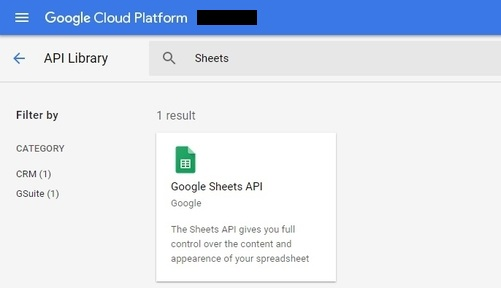
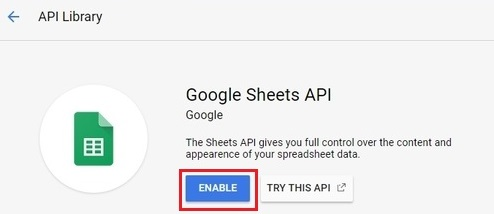

# GSheetSync

A Google Apps Script library that allows the user to create, update and remove rows of data from a Google Sheets spreadsheet.
GSheetSync is heavily inspired from the Python library Sheetsync.

SheetSync can be found here:
* Github - https://github.com/mbrenig/SheetSync
* Guide  - http://sheetsync.readthedocs.io/en/latest

##### [QuikStart - Injecting Data](#injecting-data-to-a-sheet)

## Installation

#### New to Apps Script?

You will need to open "Script Editor", Google's Apps Script development environment.
This can be done by creating a [standalone script](https://developers.google.com/apps-script/guides/standalone) or a [bound script](https://developers.google.com/apps-script/guides/bound).
For the purposes of this tutorial, let's create a bound script, a script tied to a G Suite File (sheets, docs etc.).

* Go to your [Google Drive](https://drive.google.com/drive)
* Create a new spreadsheet by following "New" > "Google Sheets"
* Open script editor through "Tools" > "Script Editor..."
* You can also read more about the [Apps Script](https://developers.google.com/apps-script)

##### In Script Editor:

1. Click on the menu item "Resources" > "Libraries"
2. You should be prompted to enter a project name, choose a name and create the project
3. In the "Add a Library" text box, enter ``Moy3-vJh6VqHfyCZp1_rX-v1b9DGPvv-L``
4. Choose a version from the dropdown box (best to pick the latest version)
5. If you happen to have editor-level access for this library, ensure "Development Mode" is "off", otherwise it does not matter
6. Click the "Save" button


## Library Methods

##### This library has 4 different methods:
* `inject` - Updates the sheet using input data, appends current cell values and adds new rows of data as required.
* `sync` - Synchronises the sheet with the input data, adding and updating rows where required. Sync also deletes rows if they are on the sheet but not in the input data.
* `convertBigQueryResults` - Takes a JSON object literal containing qeury results, acquired using Google's Big query API, and changes the results into the data format accepted by GSheetSync. Creating an array of object literals using column headers to map a row's cell values.
* `sortByHeaders` - Sorts the sheet, in ascending or descending order, using the column headers.

##### For the complete user guide, follow this link: *some_link_to_full_docs

## Enabling APIs

##### You will need the enable to following APIs:

* Sheets API (V4)
* BigQuery API (V2)

#### In Script Editor:
* "Resources" > "Advanced Google Services"
* Find and enable "BigQuery API"
* Find and enable "Google Sheets API"
* Follow the link at the bottom of the pop up box to "Google API Console"


#### In the API Console:

##### Click on "ENABLE APIS AND SERVICES"


##### Search for sheets and follow the link



##### Enable the API for your project



##### Repeat this for "BigQuery API" (ignoring "Bigquery Data Transfer API")

## Injecting data to a Sheet

GSheetSync accepts data in a very specific format.
The input data must be an array of JSON object literals. Each object within the array represents one row of data. Each key value pair represents a column header and its cell value.

##### Ensure you have completed the following steps:
* Create a blank Google spreadsheet
* Open the sheet's script editor by going on "Tools" > "Script editor..."
* Carry out the instructions in [installation](#installation)
* Also enable [these](#enabling-apis) apis before first use

##### The following array represents 3 rows of data, mapped by their column headers:

```
var data = [
  {"Name": "Alexander", "Class Level": "1. Freshman", "Extracurricular Activity": "Basketball"},
  {"Name": "Weeknd", "Extracurricular Activity": "Singing"},
  {"Name": "Dybala", "Class Level": "World", "Extracurricular Activity": "Football"}
]
```
##### To inject this data into a spreadsheet, use the following code:
```
function injectData() {
  var data = [
    {"Name": "Alexander", "Class Level": "1. Freshman", "Extracurricular Activity": "Basketball"},
    {"Name": "Weeknd", "Extracurricular Activity": "Singing"},
    {"Name": "Dybala", "Class Level": "World", "Extracurricular Activity": "Football"}
  ];
  
  var keyHeader = ["Name"];  // If your data table uses multiple keys, they all must be provided
  var headerRow = 1;
  var sheet = SpreadsheetApp.getActiveSheet();
  

  var target = new GSheetSync.GSyncTable(sheet,
                                         headerRow, 
                                         keyHeader);
  
  target.inject(data);
}

  // NOTE: There are multiple ways to instantiate a google sheet object
  //       Any combination of the following would also work:
  //         SpreadsheetApp.openByUrl(YOUR SPREADSHEET'S URL).getSheetByName(YOUR SHEET'S NAME)
  //         SpreadsheetApp.openById(YOUR SPREADSHEET'S ID).getSheetByName(YOUR SHEET'S NAME)

```

##### This produces the following result


## Complete Documentation

Please visit *some_link for the full guide and documetation for GSheetSync

## Known Bugs

There are some errors generated from time to time, these arise sporadically. Google's services, like Sheets for example, require calls to be made to Google's servers and these calls may result in the following errors:

* "Empty response" - A 401 Error which may occur sporadically at random points in the execution.
* "The service is currently unavailable." - A Google Services error, simply run the same function again.
* "We're sorry, a server error occurred. Please wait a bit and try again." - Self-explanatory, should be resolved within a few minutes.

### Actions

Unless the errors seem to say otherwise, it's best to run the same function again and everything should be fine (Apps Script itself can be a bit buggy). Apps script may some times continue from exactly where it stopped in a previous execution. This also happens if you yourself stop a function mid-way.

GSheetSync may also very rarely suffer from latency issues. If you find a standard function or script is taking longer than usual, cancel the execution and run it again.

Google has documented some common errors here: https://developers.google.com/apps-script/guides/support/troubleshooting#common_errors

## License

See [LICENSE](LICENSE.txt) here.

