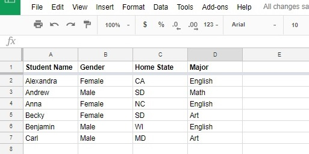
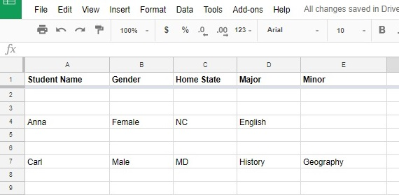

Complete Tutorial
=================
GSheetSync At A Glance
-----------------------
This library contains 1 class ``GSyncTable`` which has 5 public methods:

- ``inject`` - Updates the sheet using input data, appends current cell values and adds new rows of data as required.
- ``sync`` - Synchronises the sheet with the input data, adding and updating rows where required. Sync also deletes rows if they are not in the input data.
- ``convertBigQueryResults`` - Takes a JSON object literal containing BigQuery query results, acquired using Google's Big query API, and changes the results into the data format accepted by GSheetSync. Creating an array of object literals using column headers to map a row's cell values.
- ``readSheetData`` - Reads the data from a sheet and outputs an array containing objects, the same data structure GSheetSync takes as input.
- ``sortByHeaders`` - Sorts the sheet, in ascending or descending order, using the column headers.

The class takes the following parameters as input:

1. (Required) ``sheet``: A google sheet object, created using the ``SpreadsheetApp`` library, more on this here_
2. (Required) ``headerRow``: A number representing the location of the headers row on the sheet
3. (Required) ``keyColHeaders``: An array containing the primary key column's header (if your table uses multiple keys, then provide them all)
4. (Optional) ``optionalArgs``: An object literal containing any optional arguments. Optional arguments will be discussed in detail below.

.. _here: https://developers.google.com/apps-script/reference/spreadsheet/sheet

.. code-block:: javascript

    var sheet = SpreadsheetApp.getActiveSheet();  // Creates a sheet object
    var headerRow = 1;  // Identifying row 1 as the header row
    var keyColHeaders = ["Branch ID", "Employee ID"];  // Two columns used to uniquely identify each row of data
    var optionalArgs = {formulaRow: 2,
                        protectedfields: ["Shift assigned to"]}
    // Identifying row 2 as the formula row
    // Protecting a column called "Shift assigned to",
    //   so that sync/inject only writes (overwrites) cells in this column IF they are originally blank,
    //   thus preserving data that may have been entered/changed directly on the sheet by a user

So what can you do?
---------------------

Syncing Data:
~~~~~~~~~~~~~

We have already seen_ how data is injected into a sheet.
Where the sheet data is checked against the input data, and all data updates are written to the sheet.

.. _seen: installation.rst

However, if you want the sheet to stay synchronised with your data source, you can call the sync method on this raw data.
This method deletes any rows from the sheet if they are not in the input data. There are two ways in which rows are deleted, the first being the simple removal of a row, the second is where the primary keys of that row are flagged as deleted by concatenating a " (DELETED)" string to them.

Flagging As Deleted:
"""""""""""""""""""""
In this example, we use the following sheet:

If we want to flag unsynced data as deleted:

.. code-block:: javascript

    var data = [
        {"Student Name": "Alexandra", "Gender": "undefined", "Home State": "AC"},
        {"Student Name": "Carl", "Major": "History", "Minor": "Geography"},
        {"Student Name": "Becky", "Major": ""},
        {"Student Name": "Andrew"}
    ];
  
    var keyHeader = ["Student Name"];
    var headerRow = 1;
    var sheet = SpreadsheetApp.getActiveSheet();
  
    var target = new GSheetSync.GSyncTable(sheet,
                                           headerRow, 
                                           keyHeader);
  
    target.sync(data, false);  // Notice the data argument followed by a boolean argument
                               // false tells GSheetSync to only flag rows for deletion

This updates our sheet to look like:

.. image:: images/first_sync.jpg

Note:

- There is now a "Minor" column
- "Anna" and "Benjamin" have been flagged as deleted, and some other fields have been updated
- You do not need to enter data from the whole row when syncing it, simply enter the fields you want updated, along with the key column header(s).

Undo Delete Falgs:
""""""""""""""""""""
Now let's make the following change:

.. code-block:: javascript

    var data = [
        {"Student Name": "Alexandra", "Gender": "undefined", "Home State": "AC"},
        {"Student Name": "Carl", "Major": "History", "Minor": "Geography"},
        {"Student Name": "Becky", "Major": ""},
        {"Student Name": "Andrew"},
        {"Student Name": "Benjamin"},  // Now we include Benjamin and Anna
        {"Student Name": "Anna"}
    ];

    target.sync(data);  // The default for the sync method is to flag rows as deleted

This leads to the following updates:

.. image:: images/redo_first_sync.jpg

Note:

- "Benjamin" and "Anna" are no longer flagged as deleted

.. _sync:
.. _removed:

Removing Rows:
"""""""""""""""
Here we want to completely removes all unsynced data

.. code-block:: javascript

    var data = [
        {"Student Name": "Anna"},
        {"Student Name": "Carl"}
    ];
    target.sync(data, true);  // "true" to remove unsynced rows

Leading to the following changes:

Sorting Your Sheet:
~~~~~~~~~~~~~~~~~~~
After syncing data, if rows were removed_, your sheet will contain blank rows. You can very easily sort your sheet in ascending or descending order by any number of columns.

There are two ways you can use the ``sortByHeaders`` method

The First:

.. code-block:: javascript

    var order = true;            // Sorts in ascending order, set false for descending
    var columns = [
        "Column 1's Header",     // Sorts by first column, followed by the third column
        "Column 3's Header"
    ];
    
    target.sortByHeaders(order,  
                         columns)

If the ``columns`` argument is omitted, the sheet is sorted by the key column header(s).

The Second:

.. code-block:: javascript

    var sortSpecs = [
        {dimensionIndex: 0, sortOrder: true},   // This sorts by the first column in ASCENDING order
        {dimensionIndex: 2, sortOrder: false}   // And the by the third column in DESCENDING order
    ];

    target.sortByHeaders(sortSpecs);

Both of these result in the same sheet, but the second method allows for more control as you can sort different columns in different orders.

Follwing on from the final sync_ example, calling ``target.sortByHeaders(true)`` leads to the following:

.. image:: images/sorting_sync.jpg

.. _formula example:

Using Formulae:
~~~~~~~~~~~~~~~

One of the two optional arguments GSheetSync can take is a formula row number.
If you specify a formula row number, GSheetSync will read any and all formulae written in the cells of the formula row, and insert them into all new rows of data, intellegently incrementing them to match row and column references.

This is an example of inserting a very simple formula into column C.
The formula demonstrated here is "=B1", which is entered into cell C1. GSheetSync will intellegently incriments this formula inserting it into the 3 newly added rows of data. So that cell C3 has the formula "=B3".
Formulae are not added in any rows where data was already present, strictly added for new rows.
The column containing the formula  requires the user to input a header.

The following code allows you to use a formula on the sheet:

.. code-block:: javascript
    
    var data = [
      {"Chocolate": "Snickers", "Price": ".5"},
      {"Chocolate": "Mars", "Price": ".5"},
      {"Chocolate": "Freddo", "Price": "1"}
    ];
  
    var keyHeader = ["Chocolate"];
    // If your data table uses multiple primary keys to distinguish rows of data
    // All the keys must be provided
    var headerRow = 2;
    var sheet = SpreadsheetApp.getActiveSheet();
    var optionalArgs = {
      formulaRow: 1
    }
  
    var target = new GSheetSync.GSyncTable(sheet,
                                           headerRow,
                                           keyHeader,
                                           optionalArgs);
  
    target.inject(data);

Output on the sheet:

.. image:: images/formula_example.jpg

Protecting Specific Fields:
~~~~~~~~~~~~~~~~~~~~~~~~~~~

There may be times where you need to ensure that some fields stay protected against overwrites. In a case where there's field that people are expected to update on the sheet, but you don't account for this in the raw data, you can protect that field.

What this means is, if there is an empty cell in that column, and the input data wants to write a value in that cell, it will be written by GSheetSync. However, if a cell in that protected column is not blank (someone has purposely changed the value of the cell) then GSheetSync will not overwrite that cell.

Passing in the following parameter to GSheetSync will allow you to protect a column from overwrites:

.. code-block:: javascript

    var optionalArgs = {protectedFields: ["Some column header"]}

Reading Data From A Sheet:
~~~~~~~~~~~~~~~~~~~~~~~~~~

If you want to read the data on a sheet, and get it in the data structure compatible with GSheetSync, you can call the method ``readSheetData``.

This outputs said data structure:

.. code-block:: javascript

    var parsedData = target.readSheetData();

You can pass this data directly into GSheetSync and inject it into any of your Google Spreadsheets

Quering From Big Query:
~~~~~~~~~~~~~~~~~~~~~~~~
You can create a SQL query in Apps Script, and use the results of that query to update a Spreadsheet.

The following allows your to sync queried data:

.. code-block:: javascript

    var projectId = "YOUR PROJECT'S ID";
    var request = {
        query: ('SELECT id, title ' +
                'FROM `bigquery-public-data.samples.wikipedia` '+
                'WHERE id IS NOT NULL ' +
                'GROUP BY id, title ' +
                'LIMIT 10'),
        useLegacySql: false  // Use Lagacy(BigQuery) SQL or Standard SQL
    };
    var queryResults = BigQuery.Jobs.query(request, projectId);

    var convertedResults = target.convertBigQueryResults(queryResults);

    target.sync(convertedResults);

``"PROJECT ID"`` is required for billing and quota purposes, this is the ID that the query will run under. You can either use the Apps Script Project, which you had to create to be able to write scripts, or another project that you already have on the `Google Cloud Console`_, the latter will have the benefits of being able to control all of your querying and the BigQeury dataset's permissions under one project ID.

Getting the ID:

1. Through the Apps Script Project
    
    - In Script Editor, "Resources" > "Advanced Google Services..."
    - Follow the link to "Google API Console" at the bottom of the pop-up box
    - Click on your project name at the top of the page, and you should see something like the image below
    - From the code above, replace ``PROJECT ID`` with your project ID

2. Using your other Google Cloud Platform Projects

    - On the `Google Cloud Console`_ choose any project from the dropdown at the top left, and copy the project id for that project.

.. _Google Cloud Console: https://console.cloud.google.com

.. image:: images/project_id.jpg

Important Notes:
~~~~~~~~~~~~~~~~

- GSheetSync will only read data strictly below the formula and headers rows (which ever comes last).
- Best practise when adding formulae, is to have the formula row and headers row be together. This also demonstrated in the `formula example`_.
- Any columns in which a formula is being inserted, must have a header, otherwise no formulae will be inserted for that column.
- Formulae are only inserted for newly added rows, any rows already in the sheet before syncing/injecting will be unaffected by formulae.
- Any columns with blank headers will be left as they are, GSheetSync does nothing to blank header columns.
- Any rows flagged as deleted by the sync method, can be undeleted by running the sync method again if they are become present in the input data. (The same isn't possible if rows have been removed entirely).

Debugging 
---------
GSheetSync by default logs everything to console.
You can view all the logs by going on "View" > "Stackdriver Logging".
If this doesn't help then Script Editor's built in debugger allows your to dive into GSheetSync's source code wherever a GSheetSync method is being calledm, simply set a breakpoint on a line calling GSheetSync and dive in. A new tab will open in read-only mode containing the full GSheetSync source code.

If you find issues please raise them on `GitHub`_.
For some brownie points, read CONTRIBUTING.md and make fixes!

.. _GitHub: https://github.com/nav-s-r/GSheetSync/issues
